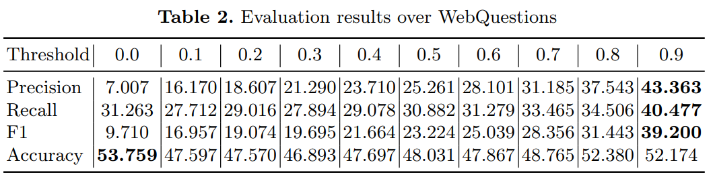

# Experiment 1: Webquestions

## With ATP

| Threshold | 0.0        | 0.1    | 0.2    | 0.3    | 0.4    | 0.5    | 0.6    | 0.7    | 0.8    | 0.9        |
| --------- | ---------- | ------ | ------ | ------ | ------ | ------ | ------ | ------ | ------ | ---------- |
| Precision | 6.172      | 14.879 | 17.456 | 19.413 | 21.410 | 23.854 | 26.533 | 28.733 | 29.879 | **37.064** |
| Recall    | **37.138** | 32.038 | 30.630 | 30.220 | 29.862 | 30.230 | 30.882 | 30.267 | 30.924 | 34.463     |
| F1        | 10.585     | 20.321 | 22.238 | 23.640 | 24.940 | 26.667 | 28.543 | 29.480 | 30.393 | **35.716** |
| Accuracy  | **60.826** | 50.944 | 48.176 | 47.301 | 46.731 | 46.878 | 47.902 | 47.430 | 46.637 | 51.190     |

#### Paper Results:

* f1 seems to be an average of f1's instead of the harmonic mean of precision and recall displayed on the table

## Without ATP

| Threshold | 0.9    |
| --------- | ------ |
| Precision | 34.291 |
| Recall    | 34.194 |
| F1        | 34.243 |
| Acuuracy  | 50.931 |

#### Paper Results:

| Threshold | 0.9    |
| --------- | ------ |
| Precision | 37.356 |
| Recall    | 32.966 |
| F1        | 32.181 |
| Acuuracy  | 48.122 |

* f1 is smaller than precision and recall

# Experiment 2: DBpedia Entity: QA

| Threshold | 0.0        | 0.1        | 0.2    | 0.3    | 0.4    | 0.5    | 0.6    | 0.7    | 0.8    | 0.9        |
| --------- | ---------- | ---------- | ------ | ------ | ------ | ------ | ------ | ------ | ------ | ---------- |
| P@1       | 35.714     | 45.945     | 44.776 | 42.622 | 44.230 | 47.619 | 50.000 | 46.666 | 47.826 | **54.545** |
| P@3       | 27.857     | **28.378** | 23.880 | 21.857 | 23.076 | 25.396 | 24.074 | 22.222 | 18.840 | 18.181     |
| P@5       | **22.142** | 19.189     | 15.820 | 14.426 | 15.000 | 15.714 | 14.444 | 13.333 | 11.304 | 10.909     |

#### Paper Results:

* from Threshold: 0.9 it seems that in the precision calculation it is not taken in consideration when the answer is smaller than n (n is the rank) so the max precision score is less than 1 and smaller than the precision at smaller ranks. 

# Experiment 3: DBpedia Entity: QA + RANKING
 
## Aproach I: Keep the score from each entity and answer as computed by the entity search system and question answering component.

| Answers added | NDCG@100  | difference | NDCG@10   | difference |
| ------------- | --------- | ---------- | --------- | ---------- |
| 0             | 0.379     | 0          | 0.287     | 0          |
| 1             | 0.407     | 0.028      | 0.307     | 0.02       |
| 3             | 0.431     | 0.052      | 0.321     | 0.034      |
| 5             | 0.441     | 0.062      | 0.324     | 0.037      |
| 10            | **0.455** | **0.076**  | **0.326** | **0.039**  |

#### Paper Results:

## Aproach II: Sum scores for entities in both rankings.

| Answers added | NDCG@100  | difference | NDCG@10   | difference |
| ------------- | --------- | ---------- | --------- | ---------- |
| 0             | 0.379     | 0          | 0.287     | 0          |
| 1             | 0.421     | 0.042      | 0.325     | 0.038      |
| 3             | 0.450     | 0.071      | 0.352     | 0.065      |
| 5             | 0.463     | 0.084      | **0.353** | **0.066**  |
| 10            | **0.474** | **0.095**  | 0.351     | 0.064      |

#### Paper Results:

